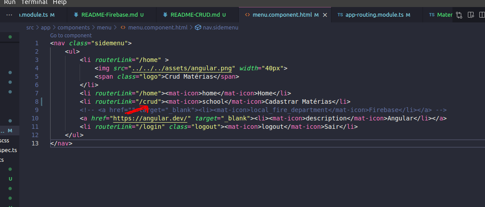
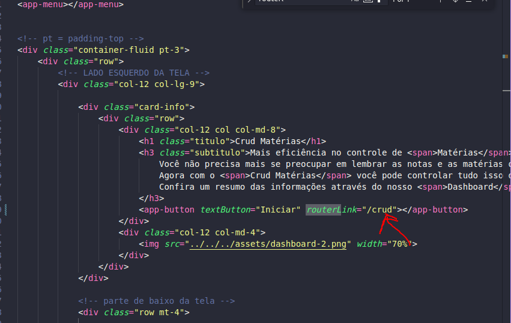

# CRUD de Matérias 

Vamos começar agora a criar nosso component de crud de matérias, para isso vamos gerar um component dentro da pasta pages:

> ng g c pages/crud

## Ajustando Rotas

Lembrando que ao criar um component ele ja deve aparecer no appmodule.ts, se por algum motivo não aparecer, basta fazer o import manual.

Vamos adicionar ele também no nosso arquivo de rotas <strong>app-routing.module.ts</strong>

Nosso arquivo ficando dessa forma:

```javascript
import { NgModule } from '@angular/core';
import { RouterModule, Routes } from '@angular/router';
import { LoginComponent } from './pages/login/login.component';
import { HomeComponent } from './components/home/home.component';
import { CrudComponent } from './pages/crud/crud.component';

const routes: Routes = [
  { path: '', component: LoginComponent },
  { path: 'login', component: LoginComponent },
  { path: 'home', component: HomeComponent },
  { path: 'crud', component: CrudComponent}
];

@NgModule({
  imports: [RouterModule.forRoot(routes)],
  exports: [RouterModule]
})
export class AppRoutingModule { }

```

Ficando agora apenas ajustar nosso <strong>Menu</strong>, pois esse component / página será renderizado sempre que for acessado o menu Materias.



E também na página <strong>home</strong>


E para finalizar vamos adicionar nosso <strong>app-menu</strong> em nosso crud component:

```html
<app-menu></app-menu>

<p>crud works!</p>

```

Para o filtro na tabela vamos usar o próprio componente do angular material
[Angular Material Filter Table](https://material.angular.io/components/table/examples)