# Criando uma conta no Firebase

Vamos a partir de agora começar a configurar o firebase como repositório de dados. Para isso, vamos:
- acessar o site do google 
- pesquisar por firebase console

Você terá como primeiro resultado o Firebase Console - Google
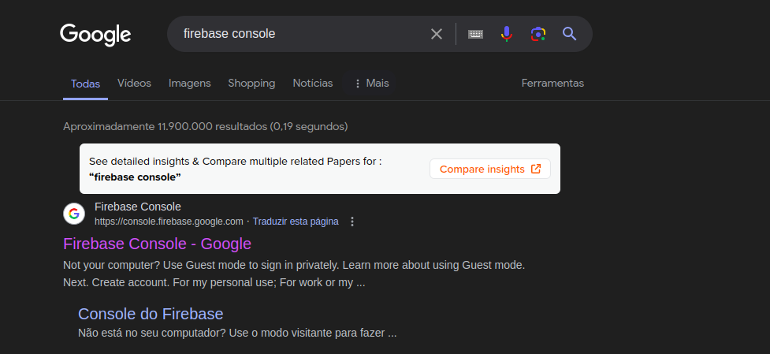

basta clicar sobre ele ou acessar o site: https://console.firebase.google.com/

## Preços

Primeiro ponto de atenção é referente aos valores, você pode começar usando o firebase com algumas limitações, porém sem custos [Link Preços do Firebase](https://firebase.google.com/pricing?hl=pt-br&_gl=1*ze4tus*_up*MQ..&gclid=EAIaIQobChMI38OgrOvuhQMVUjutBh0ugQXuEAAYASAAEgLLGPD_BwE&gclsrc=aw.ds)


## Criando um projeto no Firebase

Na tela Home do Firebase vamos clicar sobre a opção "Adicionar Projeto" e seguir preenchendo os dados necessários:


Após seguir as etapas você terá seu projeto criado:
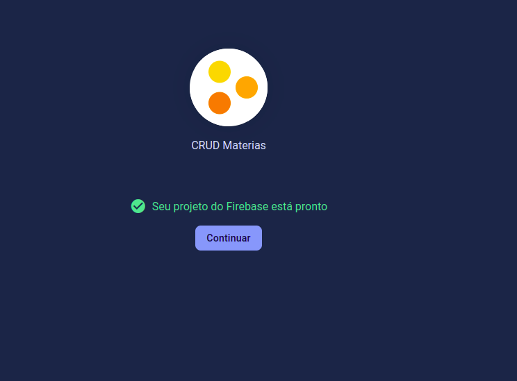

## Criando um Firestore Database

Acessando o projeto você irá encontrar no menu a esquerda a possíbilidade de criar alguns serviços, nós precisamos criar apenas o <strong>Firestore Database</strong>, 
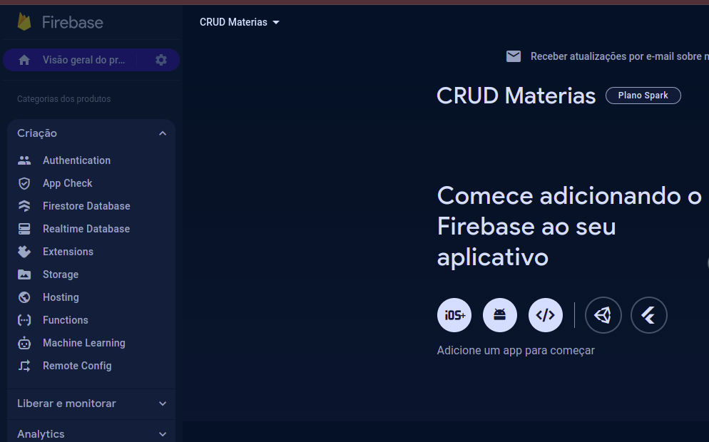

Note que o ID será o default, ele mesmo irá gerar e selecione a região do banco, por questão de uma menor latência, escolha southamerica-east-1 (São Paulo)


Vamos inciar no modo de teste, note que alterando entre os modos ele alterar as permissões de read e write
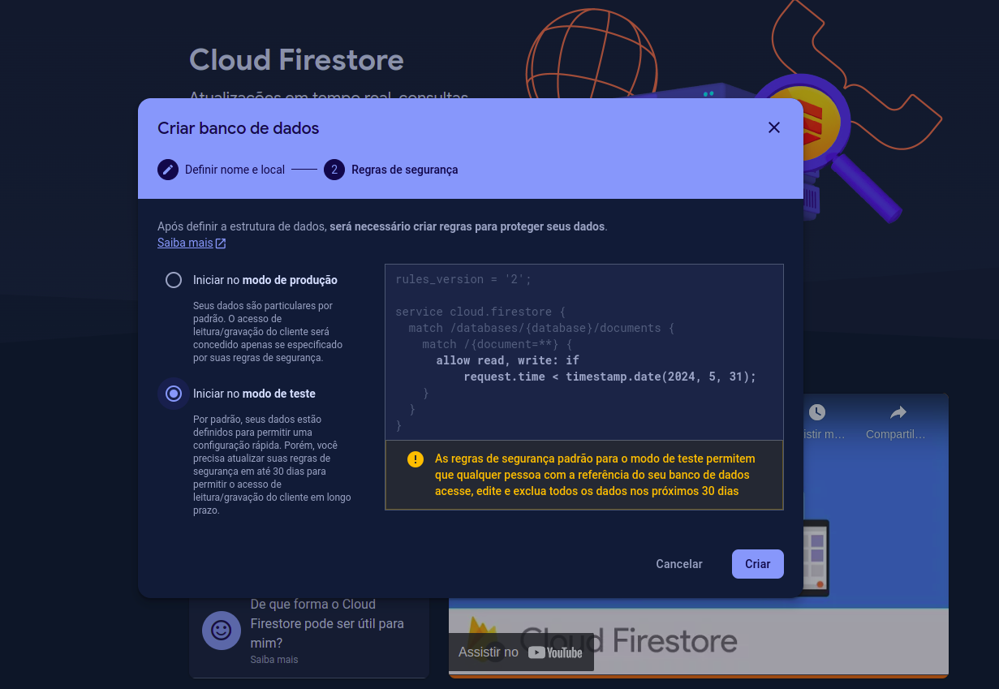

Nosso banco é não relacional, logo temos que definir o nome da coleção:
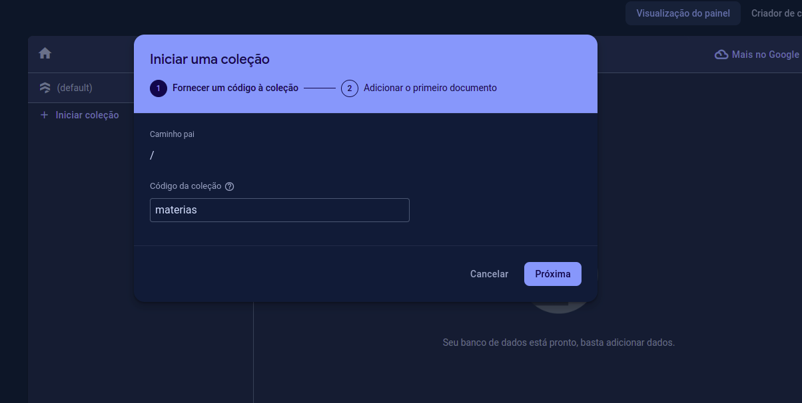

Inclusive já podemos adicionar um documento para nos ajudar nas definições e no primeiro teste de read do banco, segue o schema do documento do nosso app:
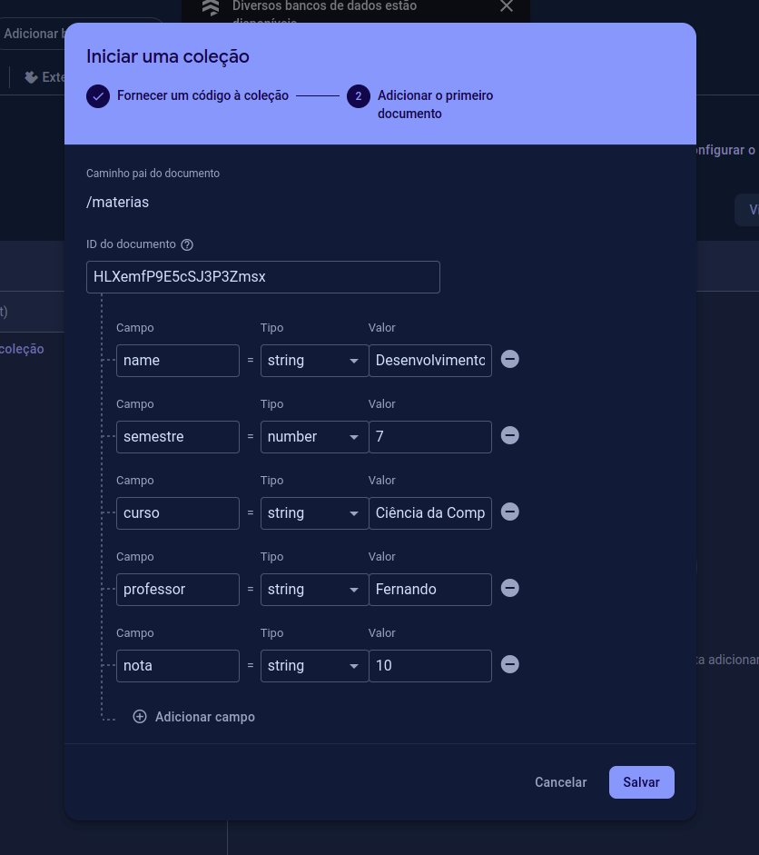

Visualizando como ficou:
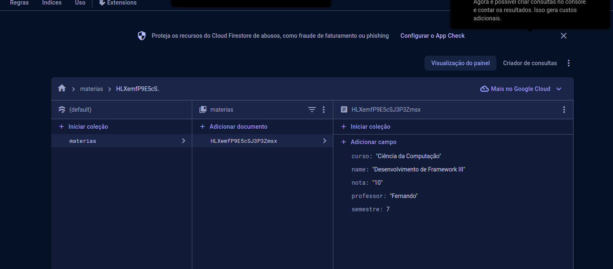

Para finalizar, vamos acessar a <strong>engrenagem</strong>, ao lado da <strong>Visão gerado do projeto</strong> e clicar sobre o menu Configurações do projeto:
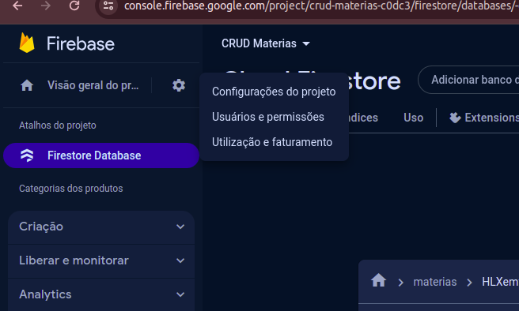

Vamos criar a configuração para adicionar o firestore ao nosso app no final da página clicando sobre a opção <strong>code</strong>
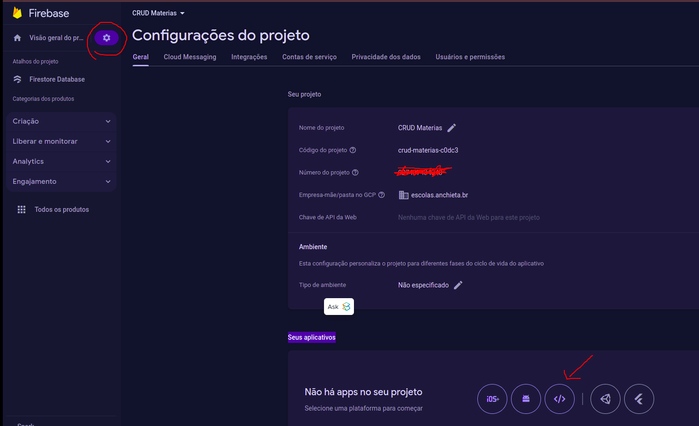

Ele vai abrir um modal para que você instale o pacote do firebase, seja pelo npm ou por script, nosso caso é por npm, e também mostrar as configurações para o seu app se conectar a conta criada no firebase:
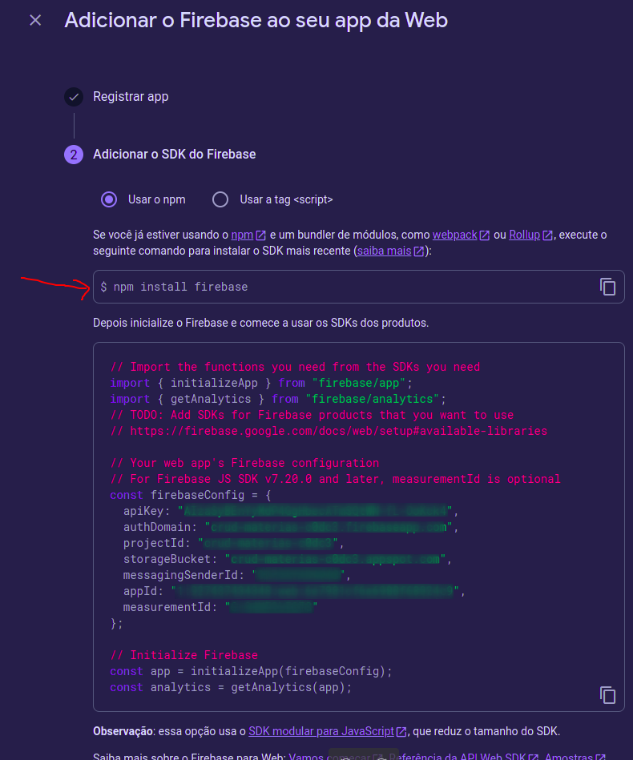


## Configurando nosso projeto 
Primeira coisa que precisamos é gerar um arquivo de environment, pois precisamos parametrizar nosso app enquanto estiver em desevolvimento, porém quando for para um ambiente de produção (entrega), provavelmente não vá usar o mesmo banco, o mesmo ambiente de forma geral, para isso vamos adicionar os environments:

> ng g environments

Note que foi criado uma pasta de environments com dois arquivos, um ded develop e um padrão.

vamos copiar o json de configuração gerado no firestore e colar aqui:
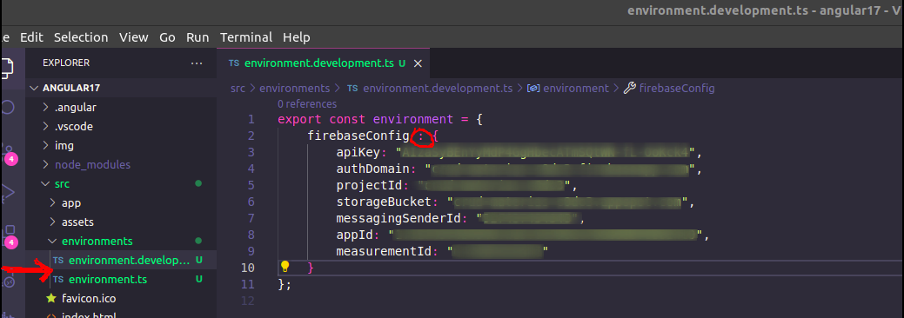

- 1 - não é necessário copiar o const
- 2 - vamos substituir o = por :
- 3 - devemos colocar ele tanto no environment.ts quanto no environment.develop.ts nesse momento

## Adicionando o pacote do firebase do angular
Para adicionar o pacote vamos rodar o comando

> ng add @angular/fire

É necessário rodar como administrador, pois note que no primeiro teste que fiz sem as permissões de administrador não foi possível concluir:
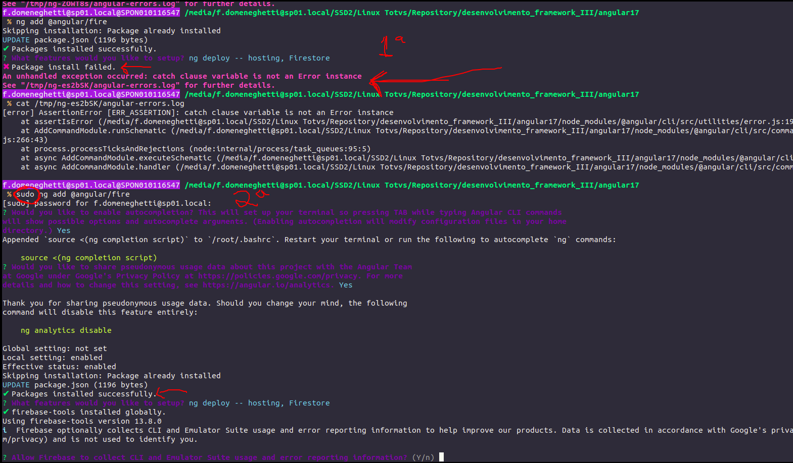

Durante a instalação você irá ter que informar qual feature vai estar configurando no setup, no nosso caso, apeas o Firestore:
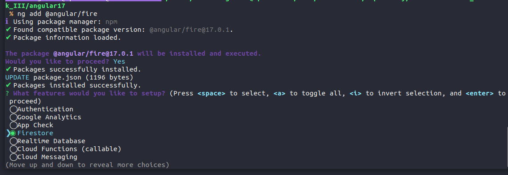

Durante a instalação, será gerado uma url para você realizar o login no app Firebase CLI, importante nesse passo usar a mesma conta que foi criado o Firestore
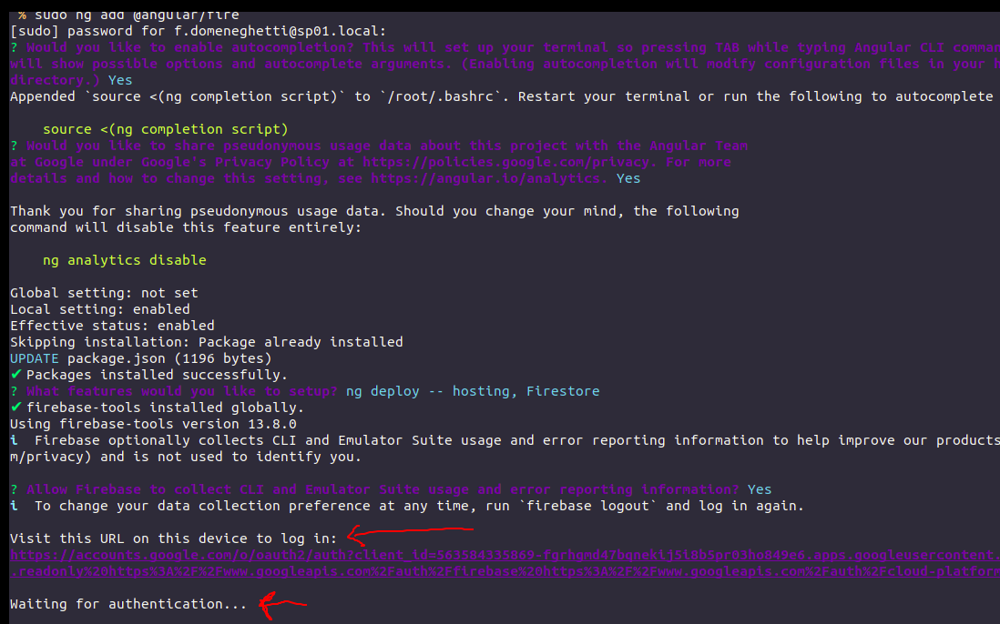

Clicando sobre o link:
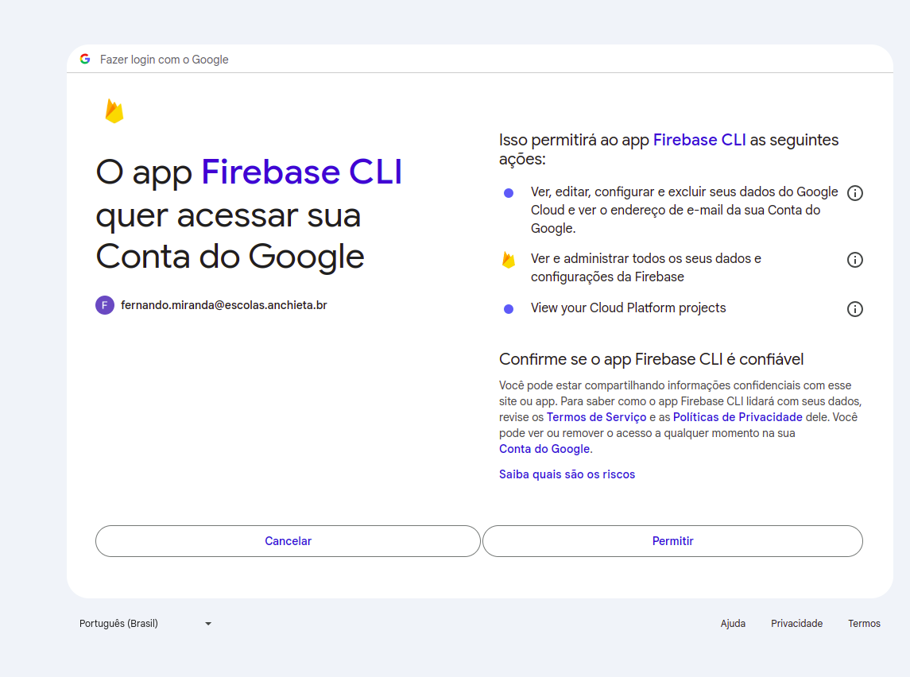

Após o login ele irá solicitar que você informe qual o Projeto que irá utilizar dado os Projetos existentes em sua conta:
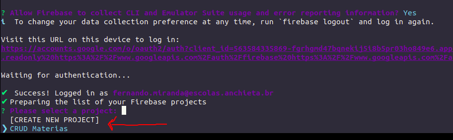

Após este passo, basta aguardar a finalização da instalação:
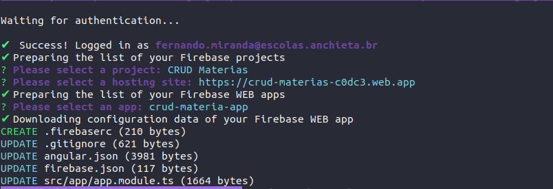

Agora, para finalizar o setup, vamos importar o Angular/Fire no nosso app.module
>import { AngularFireModule } from '@angular/fire/compat';

dentro do imports realizando a importação já lendo diretamente as configurações do nosso environment:
> AngularFireModule.initializeApp(environment.firebaseConfig)

app.module.ts fica dessa forma após a importação:
```javascript
import { NgModule } from '@angular/core';
import { BrowserModule } from '@angular/platform-browser';

import { AppRoutingModule } from './app-routing.module';
import { AppComponent } from './app.component';
import { ButtonComponent } from './components/button/button.component';
import { provideAnimationsAsync } from '@angular/platform-browser/animations/async';
import { LoginComponent } from './pages/login/login.component';
import { FormsModule } from '@angular/forms';
import { HomeComponent } from './components/home/home.component';
import { MenuComponent } from './components/menu/menu.component';

// Angular Material
import { MatIconModule } from '@angular/material/icon';
import {MatProgressSpinnerModule} from '@angular/material/progress-spinner';
import { environment } from '../environments/environment.development';

// Angular
import { AngularFireModule } from '@angular/fire/compat';

// 2ª alternativa:
//import { initializeApp, provideFirebaseApp } from '@angular/fire/app';
//import { getFirestore, provideFirestore } from '@angular/fire/firestore';

@NgModule({
  declarations: [
    AppComponent,
    ButtonComponent,
    LoginComponent,
    HomeComponent,
    MenuComponent
  ],
  imports: [
    BrowserModule,
    AppRoutingModule,
    FormsModule,
    MatIconModule,
    MatProgressSpinnerModule,

    AngularFireModule.initializeApp(environment.firebaseConfig)

    // 2ª alternativa:
    // provideFirebaseApp(() => initializeApp(environment.firebaseConfig)),
    // provideFirestore(() => getFirestore())    
  ],
  providers: [
    provideAnimationsAsync()
  ],
  bootstrap: [AppComponent]
})
export class AppModule { }

```

Agora basta rodar o app, se não apresentar nenhum erro, a conexão foi realizada com sucesso e podemos configurar nossa service de acesso ao firestore.

## Criando nossas intefaces / DTO's
Normalmente usamos as intefaces como um contrato, onde tanto o client que vai usar o contrato quanto a classe concreta que vai implementar seguem um modelo \ padrão da implementação.

No typescript podemos criar também um contrato de modelos usando as interfaces, para criar uma nova interface vamos rodar o mesmo comando que usamos para criar os components:

> ng g interface interfaces/SchoolSubject

implmentando nossa interface com as propriedades que já temos na nossa colection do firestore, a mesma fica dessa forma:

```javascript
export interface Materia {
    firebaseId?: string,
    name: string,
    semestre: number,
    curso: string,
    professor: string,
    nota: number
}
```

## Criando nosso Service para se comunicar com o firestore

Podemos começar dizendo que services são como components, a idéia do component não é criar coisas que possam ser reaproveitadas?

Agora que temos nosso banco de dados, imagine em todos lugares que forem necessários acessaro banco, ter que realizar toda configuração? Nesse caso criamos services para que eles tenha o controle, inclusive as regras de negócio centralizadas, dessa forma não precisamos reescrever a regra sempre que for salvar uma matéria e aida reaproveitamos um fluxo existente sempre que necessário. 

Para criar um services, vamos usar novamente o cli do angular assim como no components ou interfaces informando o path

> ng g s services/materias

Este comando irá criar nossa service e assim como o component já com uma estrutura default.

No construtor vamos adicionar uma propriedade para representar o AngularFirestore

> constructor(private dataBaseStore: AngularFirestore) { }

Caso o intelicense não indique o import, para usar o AngularFirestore temos que realizar os imports:

> import { AngularFirestore } from '@angular/fire/compat/firestore';

> import { Observable } from 'rxjs';


Service com os métodos de crud:
```javascript
import { Injectable } from '@angular/core';

import { AngularFirestore } from '@angular/fire/compat/firestore';
import { Observable } from 'rxjs';
import { Materia } from '../interfaces/Materia';


@Injectable({
  providedIn: 'root'
})

export class MateriasService {

  constructor(private dataBaseStore: AngularFirestore) { }

  getAll() {
    return this.dataBaseStore.collection('materias', materia => materia.orderBy('name')).valueChanges({idFiled: 'firebaseId'}) as Observable<any[]>;
  }

  create(materia: Materia) {
    return this.dataBaseStore.collection('materias').add(materia);
  }

  update(materiaId: string, materia: Materia) {
    return this.dataBaseStore.collection('materias').doc(materiaId).update(materia);
  }

  delete(materiaId: string) {
    return this.dataBaseStore.collection('materias').doc(materiaId).delete();
  }
}
```

