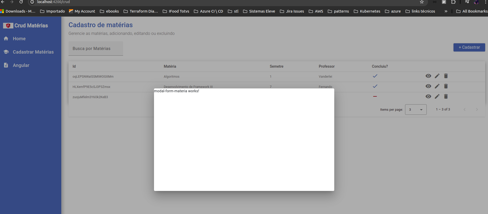

# Modal Salvar e Editar uma matéria

Seguindo com nosso projeto, vamos criar um modal para poder criar uma nova matéria e futuramente editar uma matéria existente, para isso, vamos seguir o mesmos passos na criação do modal de detalhes.

> ng g c pages/crud/modal-form-materia

Nosso componente criado, vamos criar o evento do botão de cadastrar matéria para chamar nosso modal:

```html
<app-button class="float-end mt-2" textButton="+ Cadastrar" (click)="openModalAddMateria()" ></app-button>
```

Em seguida vamos cria nossa função no crud.component.ts, que por sinal, é muito similar a função do <strong>modal view materia</strong>, porém algum alguns pontos de atenção:

```javascript
openModalAddMateria() {
    this.dialog.open(ModalFormMateriaComponent, {
      width: '700px',
      height: '400px',

    }).afterClosed().subscribe(() => this.getListMateria());
  }
```

1º Note que por estarmos fazendo o cadastro de uma matéria, não temos um objeto para passar por parametros
2º Por não termos um objeto, também não passamos o parametro <strong>data</strong> no dialog.open
3º Ao final do modal, estamos chamando a função afterClosed, ou seja, após ser fechado, um subscribe para ficar ouvindo o evento e, assim que acontecer ele chamar nossa função getListMateria para recarregar a tela

Porém no firebase, nós vimos que o subscribe do evento getAll já está sendo chamado, este modelo está aqui mais para demonstrar como pode ser feito quando você utilizar uma API ou um banco relacional.

Rodando nossa aplicação note, que o modal está sendo carregado com sucesso:



## Configurando o App.module

Garanta que seu app.module possui os imports:

```javascript
import { FormsModule, ReactiveFormsModule } from '@angular/forms';
```

## Typescript modal-form-materia