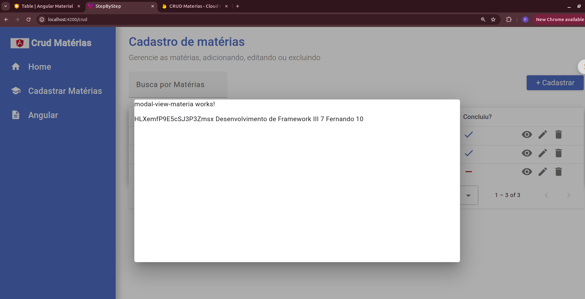
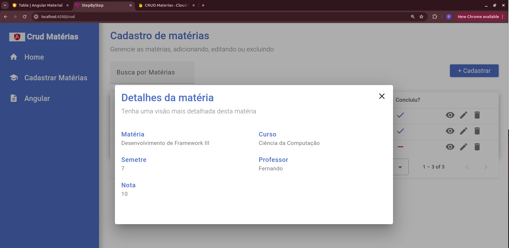

# Modal Detalhes da Matéria

## Configurando o crud.component.ts

Vamos criar um novo componente, porém, dessa vez vamos incluir este componente dentro de um já existente.
Visto que esse modal de detalhes da matéria só será acessado por está página, vamos criar ele como um componente filho da mesma

> ng g c pages/crud/modal-view-materia


Como comentado acima, este componente só será acessado por está pagina de crud, logo não precisamos configurar o mesmo no app-routing, talvez você pergunte, mas como vamos acessar o component então?

No nosso crud.compoment.html vamos adicionar o evento click no nosso icone de ações visualizar:

```html

  <mat-icon class="icone-tabela" (click)="openModalViewMateria()">visibility</mat-icon>
```

Em seguida, precisamos criar a function openModalViewMateria() no crud.component.ts:

```javascript
 openModalViewMateria() {
    
  }
```

Porém para configurar o modal, vamos importar do angular material o MatDialogModule no nosso app.module.ts:

```javascript
import { MatDialogModule } from '@angular/material/dialog';

@NgModule({
  declarations: [
    AppComponent,
    ButtonComponent,
    LoginComponent,
    HomeComponent,
    MenuComponent,
    CrudComponent,
    ModalViewMateriaComponent
  ],
  imports: [
    BrowserModule,
    AppRoutingModule,
    FormsModule,
    MatIconModule,
    MatProgressSpinnerModule,
    // provideFirebaseApp(() => initializeApp(environment.firebaseConfig)),
    // provideFirestore(() => getFirestore())

    AngularFireModule.initializeApp(environment.firebaseConfig),
    MatFormFieldModule,
    MatInputModule,
    MatPaginatorModule,
    MatTableModule, 
    MatSortModule,
    MatDialogModule
  ],
  providers: [
    provideAnimationsAsync()
  ],
  bootstrap: [AppComponent]
})
export class AppModule { }

```

Vamos voltar no nosso crud.component.ts e no construtor dele criar uma variável do tipo MatDialog: 

```javascript
constructor(private materiaService: MateriasService, public dialog: MatDialog) { 
    this.dataSource = new MatTableDataSource<Materia>(this.listMaterias);
  }
```

importante realizar o import para que o MatDialog, seja reconhecido

Pronto, agora vamos preencher nossa função, basta informar a variável que criamos this.dialog.open e passar o nome do component como primeiro parametro:

```javascript
openModalViewMateria(materia: Materia) {
    this.dialog.open(ModalViewMateriaComponent, {
      width: '700px',
      height: '350px',
      data: materia
    })
  }
```

Note que o segundo parametro é um objeto, onde configuramos a largura e altura do nosso modal e também o dado que deverá ser passado por parametro na função.

Para passar o dado como parametro, vamos voltar no crud.component.html e na função click que criamos e passarmos a variavel matéria que configuramos no td:
matCellDef="let materia"

ficamos dessa forma o html:
```html
 <ng-container matColumnDef="actions">
    <th class="th-table" mat-header-cell *matHeaderCellDef mat-sort-header></th>
    <td class="td-table" mat-cell *matCellDef="let materia">
        <mat-icon class="icone-tabela" (click)="openModalViewMateria(materia)">visibility</mat-icon>
        <mat-icon class="icone-tabela">edit</mat-icon>
        <mat-icon class="icone-tabela">delete</mat-icon>
    </td>
</ng-container>
```


## Criando o modal-view-materia

Vamos precisar realizar algumas ações no nosso modal-view-materia.component.ts:
- uma variavel para receber esse objeto que vai ser enviado durante o click
- ajustar nosso construtor para receber uma propriedade que é do tipo MatDialogRef
- ajustar nosso construtur para Injetar o dado a uma variável
- criar uma função para fechar o modal
- ah! realizar os imports necessários

Nosso arquivo modal-view-materia.component.ts, fica dessa forma:

```javascript
import { Component, Inject } from '@angular/core';
import { Materia } from '../../../interfaces/Materia';
import { MAT_DIALOG_DATA, MatDialogRef } from '@angular/material/dialog';

@Component({
  selector: 'app-modal-view-materia',
  templateUrl: './modal-view-materia.component.html',
  styleUrl: './modal-view-materia.component.scss'
})
export class ModalViewMateriaComponent {
  materiaData: Materia;


  constructor(public dialogRef: MatDialogRef<ModalViewMateriaComponent>, @Inject(MAT_DIALOG_DATA) public data: any) { 
    console.log('Data recebida', data);
    this.materiaData = data;
  }

  closeModal() { this.dialogRef.close(); }
}

```

Para visualiar os dados no html, vamos apenas fazer um bind do nosso objeto materiaData:

```html
<p>modal-view-materia works!</p>


{{materiaData.firebaseId}}
{{materiaData.name}}
{{materiaData.semestre}}
{{materiaData.professor}}
{{materiaData.nota}}
```

Realizando um teste, ao clicar sobre qualquer matéria, note que a matéria clicada é carregada no modal, agora faltando apenas melhorar a aparência:


Vamos criar nosso html e css, ficando com o resultado final:
