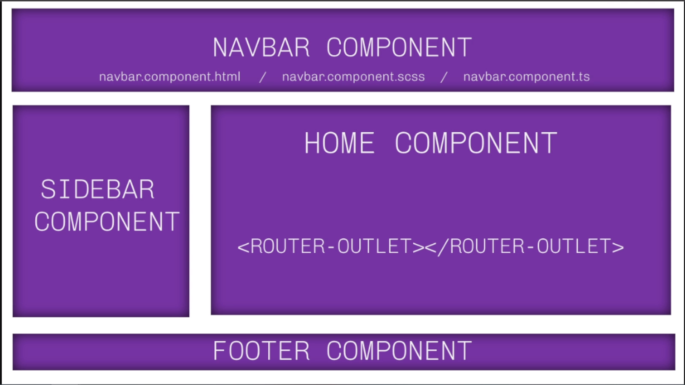
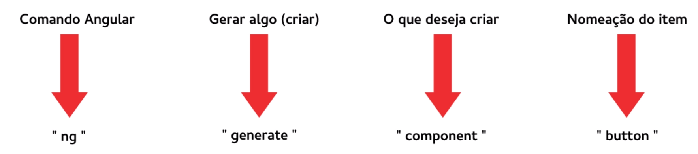
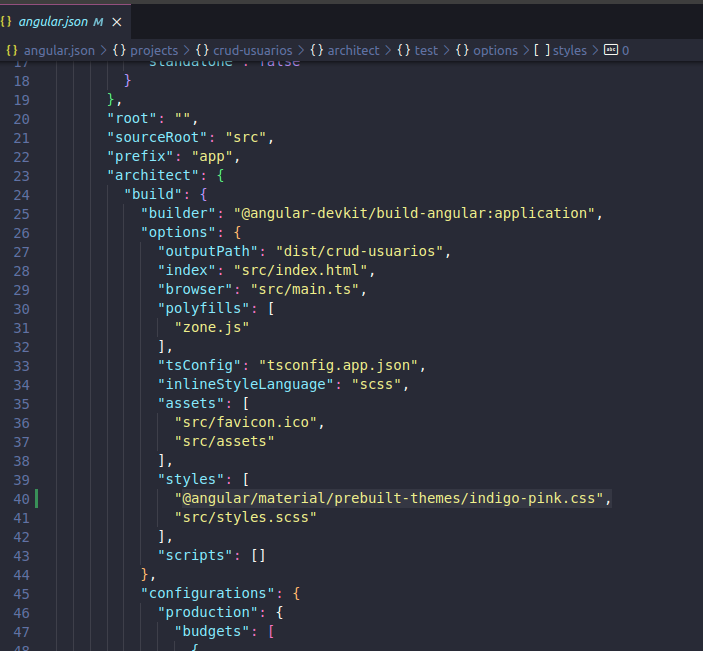
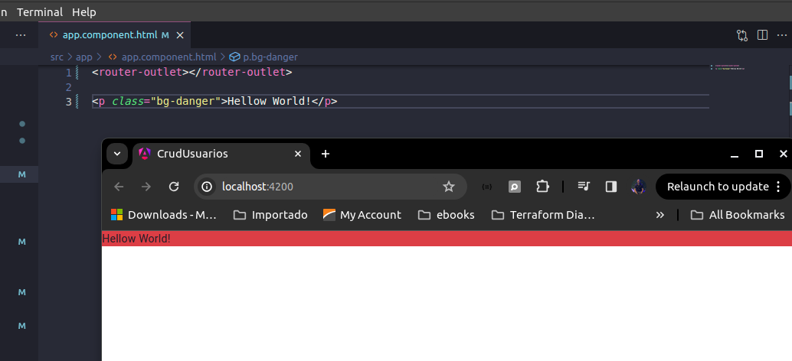
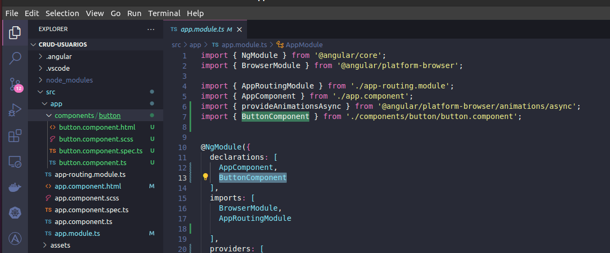
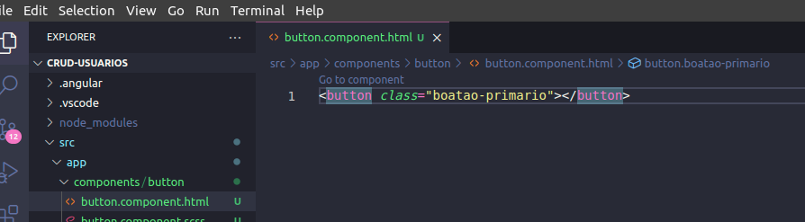
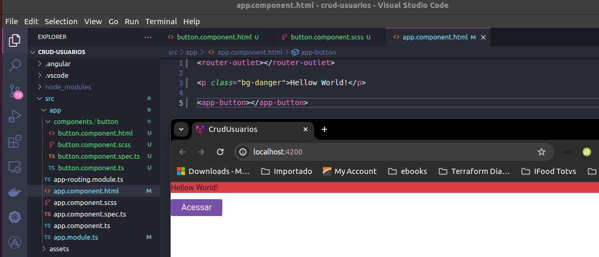
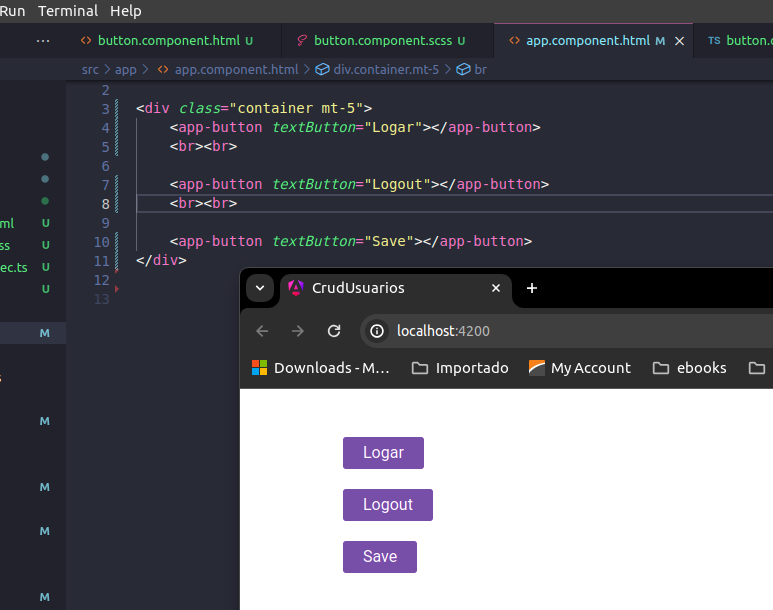
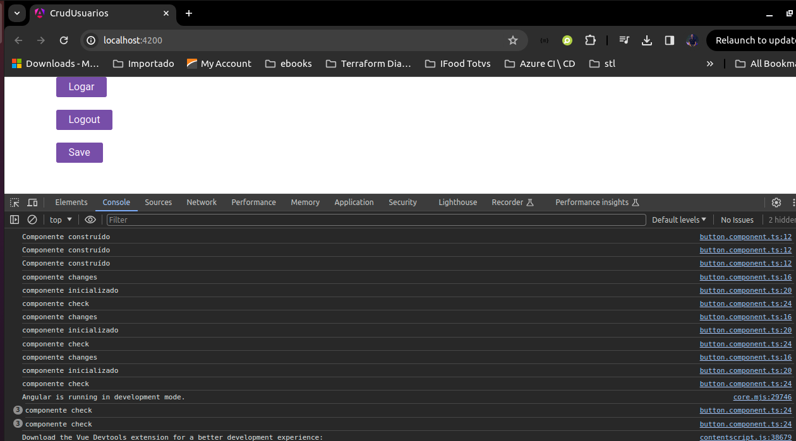
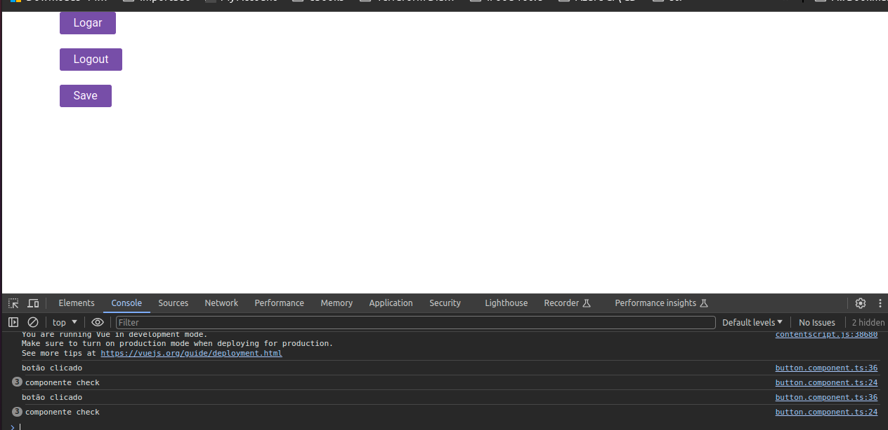

# Criando um projeto com Angular 17

Passo a passo default para instalar e criar um projeto com angular:

>- npm install -g @angular/cli
>- ng new my-app
>- cd my-app
>- ng serve

Na versão 17 ele não tem mais o app.module padrão, para criar um projeto na versão 17 mantendo o app.module deve-se usar o parametro --no-standalone:

## Componentes

Componentes podem ser grandes como na imagem, mas podem ser algo menor, como um botão.



### Criando um Componente

Para criar um component basta utilizar a cli passando o tipo como component e o nome do componente que deseja criar:




Exemplo:
- ng generate componet components/button

<i>Neste exemplo já está sendo informado a pasta onde será criado o componente</i>


## Criando nosso projeto

Para criar nosso projeto vamos rodar o comando abaixo:

> ng new crud-usuarios --no-standalone

Para validar se a aplicação está funcionando, na pasta raiz do projeto criado e rodar o comando:

> ng serve -o

<i>a flag -o irá fazer com que a saída já seja o navegador</i>


### Instalando o bootstrap

Você pode encontrar várias formas de obter o pacote através do site: [Site-boostrap](https://getbootstrap.com/docs/5.3/getting-started/download/)

Neste projeto vamos obter o Boostrap através do npm 

> npm install bootstrap@5.3.3

No styles.scss do projeto vamos adicionar o bootstrap de forma global com a linha a seguir:

> @import '../node_modules/bootstrap/dist/css/bootstrap.min.css';

### Instando o Angular Material

Angular Material é um framework visual com vários componentes prontos para serem utilizados e estilizados no projeto, você pode ver mais sobre o angular material no site: [Angular-Material](https://material.angular.io/)

Para instalar o Angular Material basta rodar no projeto o comando:

> ng add @angular/material

Ao final da instalação note que ele mudou alguns arquivos:

1 - styles.scss: Definiu as fontes do body

```scss
/* You can add global styles to this file, and also import other style files */

@import '../node_modules/bootstrap/dist/css/bootstrap.min.css';
html, body { height: 100%; }
body { margin: 0; font-family: Roboto, "Helvetica Neue", sans-serif; }
```

2 - package.json: Adicionou o boostrap e o @angular/material como dependência

3 - index.html: Adicionou a typografia e os links do Material-icon

```html
<!doctype html>
<html lang="en">
<head>
  <meta charset="utf-8">
  <title>CrudUsuarios</title>
  <base href="/">
  <meta name="viewport" content="width=device-width, initial-scale=1">
  <link rel="icon" type="image/x-icon" href="favicon.ico">
  <link href="https://fonts.googleapis.com/css2?family=Roboto:wght@300;400;500&display=swap" rel="stylesheet">
  <link href="https://fonts.googleapis.com/icon?family=Material+Icons" rel="stylesheet">
</head>
<body class="mat-typography">
  <app-root></app-root>
</body>
</html>
```

4 - angular.json: Adicionou no styles o tema escolhido do angular-material



### Realizando um teste com bootstrap

Na pagina index.html dentro do app criar um parágrafo com a class bg-danger



Outros tipos de background color podem ser encontrados no link [Background-color](https://getbootstrap.com/docs/5.3/utilities/background/#background-color)

### Criando nosso primeiro componente 

Vamos criar um componente através do comando

> ng generate component components/button

Ao final, note que tanto a pasta components/button foi criada já com os arquivos necessários do component assim como o app.module já foi injetado este novo componente



Vamos editar o html do componente adicionando a tag abaixo



Vamos estilizar esse botão editando o scss do mesmo

```scss
.botao-primario {
    width: auto; // deixa automático obedecendo o do tamanho do texto
    outline: none; // Outline é muito útil quando se quer remover o comportamento padrão do browser de adicionar uma borda a um elemento quando ele esta selecionado
    border: 0;
    background: #417ec0;
    color: #fff;
    font-weight: 400;
    font-size: 16px;
    padding: 6px 20px;
    border-radius: 3px;
    box-shadow: 0px 0ox 3px 1px #0a0a0a20; // sombra no botão
    transition: 0.3s linear all; 
    &:hover {
        cursor: pointer;
        box-shadow: 0px 0px 5px 3px #0a0a0a40;;
    }
    &:disabled {
        cursor: default;
        opacity: 0.7; 
    }
}
```

Visualizando nosso component, vamos adicionar no <b>app-component.html</b> nosso <b>button-component</b>




Vamos deixar esse button mais dinâmico, ficando mais próximo de um componente que pode ser reutilizavel

No arquivo butto.component.ts, vamos adicioinar uma variável textButton, como mostro a seguir

```javascript
import { Component, Input } from '@angular/core';

@Component({
  selector: 'app-button',
  templateUrl: './button.component.html',
  styleUrl: './button.component.scss'
})
export class ButtonComponent {
  @Input() textButton: string // @Input permite que nossa váriavel possa receber um valor de fora
}
```

No button.component.html, vamos criar um link a variável através do two way data binding:

```html
<button class="botao-primario">{{textButton}}</button>
```

Para fechar, vamos adicionar agora 3x o app-button dentro do app.component.html com valores diferentes

```html
<router-outlet></router-outlet>

<div class="container mt-5">
    <app-button textButton="Logar"></app-button>
    <br><br>

    <app-button textButton="Logout"></app-button>
    <br><br>

    <app-button textButton="Save"></app-button>
</div>
```

Tendo como resultado:


### Criando variáveis no scss global

```scss

/* You can add global styles to this file, and also import other style files */

@import '../node_modules/bootstrap/dist/css/bootstrap.min.css';
html, body { height: 100%; }
body { margin: 0; font-family: Roboto, "Helvetica Neue", sans-serif; }

//:root: Este é um seletor CSS que seleciona a raiz do documento. No caso de HTML, é o mesmo que selecionar o elemento html. As variáveis definidas aqui estão disponíveis globalmente em todo o CSS.
:root { 
    --primary-color: #7533a8;
    --error-color: #ac2828;
    --gray-color: #747474;
}


//.c-primary, .c-error, .c-gray: Estes são seletores de classe CSS. Eles selecionam elementos que têm a classe correspondente. Por exemplo, .c-primary seleciona todos os elementos que têm a classe c-primary.
.c-primary { color: var(--primary-color); }
.c-error { color: var(--error-color); }
.c-gray { color: var(--gray-color); }

.hover:hover{ cursor: pointer; }
```

### Lyfecycle Hooks

Vamos enteder o ciclo de vida dos componentes, uma linha do tempo desde o início ao fim

[Visão Geral do Ciclo de Vida Angular v2](https://v2.angular.io/docs/ts/latest/guide/lifecycle-hooks.html)


[Visão Geral do Ciclo de Vida Angular v17](https://angular.io/guide/lifecycle-hooks)

Cada mudança nesse ciclo é uma função nativa do angular e podemos utilizar para facilitar nosso desenvolvimento.

Normalmente não é utilizado todos os eventos, os mais comuns são:

- constructor
- ngOnInit
- ngOnDestroy

em alguns casos para monitorar uma váriavel é usado o 

- ngOnChanges

Vamos adicionar no nosso componente <b>button.component.ts</b> os eventos e realizar um log sempre que um evento for chamado


```javascript
import { Component, Input } from '@angular/core';

@Component({
  selector: 'app-button',
  templateUrl: './button.component.html',
  styleUrl: './button.component.scss'
})
export class ButtonComponent {
  @Input() textButton: string // @Input permite que nossa váriavel possa rececber um valor de fora

  constructor() {
    console.log('Componente construído');
  }

  ngOnChanges() {
    console.log('componente changes');
  }

  ngOnInit() {
    console.log('componente inicializado');
  }

  ngDoCheck() {
    console.log('componente check');
  }

  ngAfterViewIniit() {
    console.log('componente view inicializada');
  }

  ngOnDestroy() {
    console.log('destruido');
  }

}
```

Olhando o console.log na ferramenta do desenvolvedor do navegador



Vamos adicionar uma função chamada teste, logo após a função ngOnDestroy, que apenas faz um log sempre que for chamada


```javascript
teste() {
    console.log('botão clicado');
  }
```

E vamos alterar nosso html chamando essa função sempre que o button for clicado

```html
<button class="botao-primario" (click)="teste()">{{textButton}}</button>
```

Note que sempre que houver o click ele irá chamar tanto a função teste como a ngDoCheck



Então tome cuidado ao usar a função ngDoCheck, pois ela é pesada e sempre será acionada 

### Event Binding

É a vinculação de eventos que permite ouvir e resposnder as ações do usuário, como pressionamentos de teclas, movimentos do mouse, cliques e toques.

[Angular Event Bindings](https://angular.io/guide/event-binding)


[Lista de eventos Angular](https://edupala.com/angular-events-binding-and-angular-event-list/)


### Componente Login

No terminal, navegar até a pasta raiz do projeto em seguida rodar o comando

> ng g c pages/login

Este componente não será criado na pasta components pois se trata de uma tela especifica para o login, então vamos criar o mesmo na pasta pages

No arquivo app-routing.module.ts, vamos adicionar um path de login no Routes

```javascript

import { NgModule } from '@angular/core';
import { RouterModule, Routes } from '@angular/router';
import { LoginComponent } from './pages/login/login.component';

const routes: Routes = [
  { path: 'login', component: LoginComponent }
];

@NgModule({
  imports: [RouterModule.forRoot(routes)],
  exports: [RouterModule]
})

export class AppRoutingModule { }
```

Como queremos que ao entrar na aplicação (quando não é informado um path) ele acesse a tela de login, vamos adicionar também o path vazio redirecionando para o loginComponent

```javascript

import { NgModule } from '@angular/core';
import { RouterModule, Routes } from '@angular/router';
import { LoginComponent } from './pages/login/login.component';

const routes: Routes = [
  { path: '', component: LoginComponent},
  { path: 'login', component: LoginComponent }
];

@NgModule({
  imports: [RouterModule.forRoot(routes)],
  exports: [RouterModule]
})

export class AppRoutingModule { }
```

No login.component.html iremos criar duas divs, onde a primeira deverá apresentar uma image e a segundo onde teremos um form para que o usuário informe seu nome, note que eu já configurei no input o "two way data binding", porém para usar o ngModel foi necessário no app.mdoule.ts fazer o import no FormsModel, ficando

#### app.module.ts

```javascript
import { NgModule } from '@angular/core';
import { BrowserModule } from '@angular/platform-browser';

import { AppRoutingModule } from './app-routing.module';
import { AppComponent } from './app.component';
import { ButtonComponent } from './components/button/button.component';
import { provideAnimationsAsync } from '@angular/platform-browser/animations/async';
import { LoginComponent } from './pages/login/login.component';
import { FormsModule } from '@angular/forms'; //Adicionar para funcionar o ngModel

@NgModule({
  declarations: [
    AppComponent,
    ButtonComponent,
    LoginComponent
  ],
  imports: [
    BrowserModule,
    AppRoutingModule,
    FormsModule //Adicionar para funcionar o ngModel
  ],
  providers: [
    provideAnimationsAsync()
  ],
  bootstrap: [AppComponent]
})
export class AppModule { }
```

#### login.compoent.html 

```html
<div class="area-login-background d-none d-md-block"></div>

<div class="area-form">
    <form>
        <h1 class="titulo">CRUD MATÉRIAS</h1>
        <h2 class="subtitulo">Melhor site de controle de notas</h2>

        <input [(ngModel)]="userName" [ngModelOptions]="{standalone: true}" class="input-form" type="text" placeholder="Digite seu nome">

        <app-button textButton="Acessar" size="100" (click)="login()"></app-button>
    </form>

    <p class="footer">© 2024 | Desenvolvido por Fernando Domeneghetti</p>
</div>
```

Você precisa agora no login.component.ts adicionar a variável userName que estamos usando no input

```javascript
import { Component } from '@angular/core';

@Component({
  selector: 'app-login',
  templateUrl: './login.component.html',
  styleUrl: './login.component.scss'
})
export class LoginComponent {
  userName: string = '';
}
```

Por fim, vamos adicionar um estilo a nossa página, para isso adicione o conteúdo a seguir dentro do arquivo login.component.scss

```css
.area-login-background {
    height: 100%;
    width: 55%;
    display: block;
    float: left;
    background-image: url('../../../assets/background-login.jpeg');
    background-color: var(--primary-color);
    background-size: 100% auto;
    background-position: center top;
    background-repeat: repeat-y
}

.area-form {
    height: 100%;
    width:45%;
    float: left;
    background: white;
    display: flex;
    align-items: center;
    justify-content: center; // Add this line
    flex-wrap: nowrap;
}

@media only screen and (max-width: 767px) {
    .area-form { width: 100%; }
}

.titulo {
    font-size: 26px;
    font-weight: bold;
    text-align: center;
    letter-spacing: 7px;
    color: var(--primary-color);
    padding: 0;
    margin-bottom: 6px;
}

.subtitulo {
    font-size: 16px;
    font-weight: 300;
    color: var(--gray-color);
    margin: 0px 0px 30px 0px;
    padding: 0;
    text-align: center;
}

.input-form {
    outline: none;
    padding: 8px 10px;
    width: 100%;
    border-radius: 4px;
    border: 1px solid #00000000; // 6x 0 é a cor, porém quando se usa 8x 0 é para deixar transparente
    margin-bottom: 32px;
    transform: 0.3s linear all;
    box-shadow: inset 1px 1px 2px #babecc80, inset -1px -1px 2px #d8d8d8b0; // inset serve para sombra interna
    &:focus {
        border: 1px solid var(--primary-color);
    }
}

.footer {
    position: absolute;
    bottom: 4px;
    color: var(--primary-color);
    font-size: 10px;
}
```

### Componente Home

No terminal, navegar até a pasta raiz do projeto em seguida rodar o comando

> ng g c components/home

Após rodar o comando, note que o componente Home foi criado e injetado no app.module.ts

#### app-routing.module.ts
Vamos adicionar o componente no path da mesma forma que fizemos para o LoginComponent:

```javascript
import { NgModule } from '@angular/core';
import { RouterModule, Routes } from '@angular/router';
import { LoginComponent } from './pages/login/login.component';
import { HomeComponent } from './components/home/home.component';

const routes: Routes = [
  { path: '', component: LoginComponent },
  { path: 'login', component: LoginComponent },
  { path: 'home', component: HomeComponent } //adicionado login no path
];

@NgModule({
  imports: [RouterModule.forRoot(routes)],
  exports: [RouterModule]
})
export class AppRoutingModule { }
```


#### login.component.ts
No nosso arquivo login.component.ts, vamos configurar através do router para navegar para a /home sempre que a função login for executada.

```javascript
export class LoginComponent {
  userName: string = '';

  // adicionar o router para navegar entre as páginas > ir para home
  constructor(private router: Router) {

  }

  login() {
    sessionStorage.setItem('user', this.userName);
    this.router.navigate(['home']);
  }
}
```